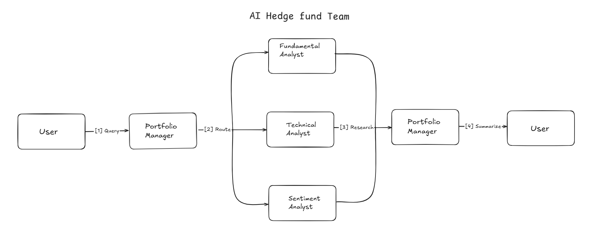

# Hedge Fund Agent Team



This project is a simulation of a basic hedge fund research team powered by AI agents using LangChain and LangGraph. It includes a team of four specialized agents:

- **Portfolio Manager**
- **Fundamental Analyst**
- **Technical Analyst**
- **Sentiment Analyst**

These agents collaborate to analyze stock data and provide insights into a stock's financial, technical, and market sentiment aspects. The system serves as a foundation for creating customized, automated investment analyses.

## Project Overview

The **Hedge Fund Agent Team** simulates an automated investment analysis team composed of four specialized agents:

- **Portfolio Manager**: Oversees and summarizes the team’s findings into a cohesive investment analysis.
- **Fundamental Analyst**: Analyzes financial statements, revenue, and profit metrics.
- **Technical Analyst**: Monitors and reports real-time stock prices.
- **Sentiment Analyst**: Gathers the latest news and public sentiment for market impact.

The team operates in parallel, leveraging LangGraph’s branching capabilities to provide a comprehensive view of a stock’s performance and potential investment appeal.

## Features

- **Automated Financial Analysis**: Accesses over 30,000 tickers through @findatasets to retrieve and analyze financial data.
- **Real-Time Data**: Retrieves live stock prices and daily changes.
- **Sentiment Analysis**: Gathers recent news headlines and market sentiment.
- **Parallel Execution**: Utilizes LangGraph's branching to allow agents to run tasks in parallel, improving efficiency.

## Installation

Clone this repository and install the required dependencies:

```bash
git clone https://github.com/shaikhmubin02/ai-hedge-fund.git
cd ai-hedge-fund
pip install -r requirements.txt
```

## Usage

To run the Hedge Fund Agent Team analysis, initiate an input query for any stock ticker, such as "AAPL":

```python
from langchain import graph

# Define input for the team
input_data = {
    "messages": [HumanMessage(content="What is the latest news, stock price, and revenue for AAPL?")]
}
config = {"recursion_limit": 10}

# Run the team
stream_agent_execution(graph, input_data, config)
```

This will execute the agent team and display a comprehensive report based on each agent's analysis.

---